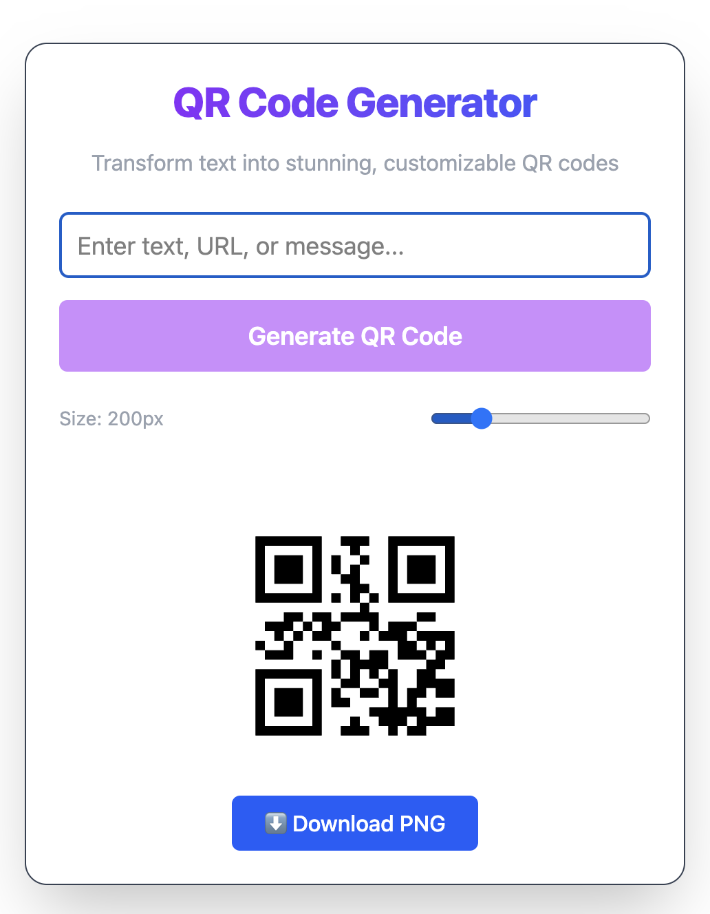

# 📱 QR Code Generator

A simple and interactive **QR Code Generator** built with **Vite + React + TailwindCSS**.  
This project demonstrates how to integrate and customize QR codes in a React application.

---

## 🚀 Features
- 🔑 Generate QR codes from text, URLs, or messages
- 🎨 Customize **size, foreground, and background colors**
- 📥 Download QR codes as **PNG images**
- 📋 Copy generated text to clipboard
- ✅ Beautiful UI with **toast notifications**
- 🌌 Modern design with gradient + glassmorphism

---

## 🛠️ Tech Stack
- **Vite** – Fast React build tool
- **React** – UI library
- **TailwindCSS** – Styling
- **qrcode.react** – QR code generation
- **react-hot-toast** – Toast notifications

---

## 📦 Installation & Setup

1. Clone the repository:
   ```bash
   git clone https://github.com/your-username/qr-code-generator.git
   cd qr-code-generator


2. Install dependencies:

```
npm install
```

3. Start development server:

```
npm run dev
```

4. Open in browser:

```
http://localhost:5173
```

## 📸 Screenshots
Home Page



## 📚 Learning Goals
This project was created to learn how QR codes can be integrated into web apps. 
Key takeaways:

- Using third-party React components (qrcode.react)

- Handling form submissions and state management in React

- Exporting a Canvas element as a downloadable PNG

- Improving UX with toasts & interactivity

## 🔮 Future Improvements
- Add QR SVG export option

- Support for logo in center of QR

- Mobile responsive improvements

- Dark/Light mode toggle

